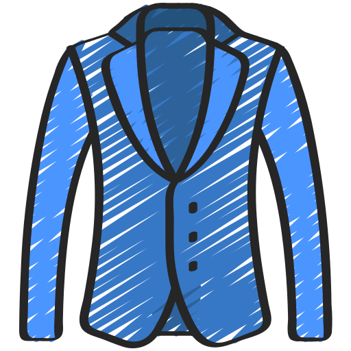

<!-- markdownlint-disable MD033 MD041 -->

# Tuxedo

---

Refined types for the suave :cocktail: .NET developer

---

<!-- markdownlint-enable MD033 MD041 -->

## Why?

More precise types can help to reduce the number of bugs in your code. Tuxedo
provides a set of type refinements that can be used to make your code more
precise and catch bugs faster.

For more details/information keep reading the docs or have a look at the test
projects or create an issue.
